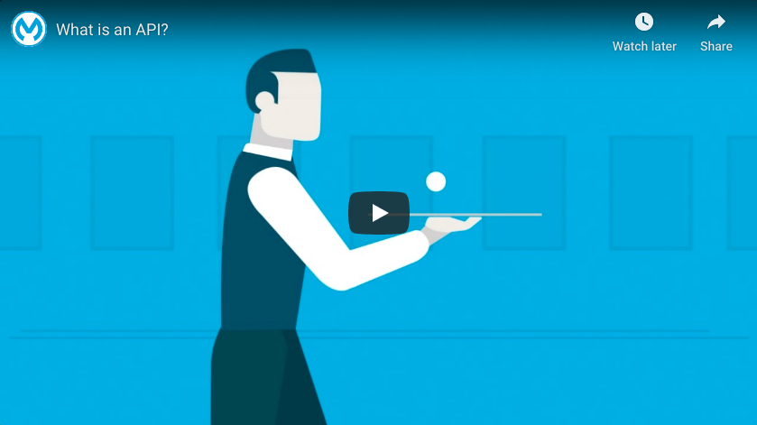
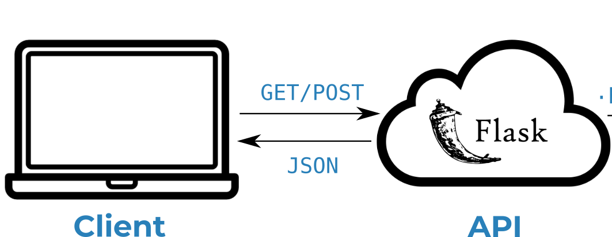
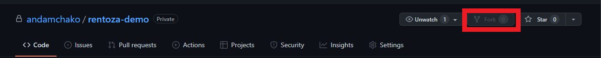

# Flask-based API
#### Rentoza Demo
<center></center>

### Table of Contents

- [Flask-based API](#flask-based-model-api)
  * [1) Overview](#1-overview)
      - [1.1) Wait, what is an API again?](#11-wait-what-is-an-api-again)
      - [1.2) How our API will work](#12-how-our-api-will-work)
        * [Description of files](#description-of-files)
  * [2) Usage Instructions](#2-usage-instructions)
      - [2.1) Creating a copy of this repo](#21-creating-a-copy-of-this-repo)
      - [2.2) Running the API on your local machine](#22-running-the-api-on-your-local-machine)
        * [Prerequisites](#prerequisites)
        * [Making the changes](#making-the-changes)
      

## 1) Overview


#### 1.1) Wait, what is an API again?

[](https://youtu.be/s7wmiS2mSXY)

An API - or Application Programming Interface - refers to a set of procedures and protocols that allows us to send and request information between ourselves and remote applications. You can think of this as a channel of communication to a remote server using specific commands that allow you to use their applications without needing to host that functionality yourself. Many types of API's exist, but for this predict task we are interested specifically in Web API's. These allow us to send and receive information using web development languages, such as HTML and JSON. The video above provides a simple and intuitive explanation of how API's operate.

#### 1.2) How our API will work


##### Description of files

Several files within this repository enable the correct functioning of our API. We provide a high-level description of these salient files within the table below:

| File Name           | Description                                                                        |
|:--------------------|:-----------------------------------------------------------------------------------|
| `app.py`            | Flask web server application definition and instantiation.                         |
| `model.py`          | Contains helper functions to separate model specific code from our API definition. |
| `utils/config.py`   | Simple script that contains the configurations for our API.                        |
| `test/unit/`        | Unit tests for our helper functions.                                               |
| `test/integration/` | Integration tests for our API routes.                                              |

## 2) Usage Instructions

#### 2.1) Creating a copy of this repo

| :zap: WARNING :zap:                                                                                     |
|:--------------------------------------------------------------------------------------------------------|
| Do **NOT** *clone* this repository. Instead follow the instructions in this section to *fork* the repo. |


  

To fork the repo, simply ensure that you are logged into your GitHub account, and then click on the 'fork' button at the top of this page as indicated within the figure above.


#### 2.2) Running the API on your local machine

As a first step to becoming familiar with our API's functioning, we recommend setting up a running instance on your own local machine.

To do this, follow the steps below by running the given commands within a Git bash (Windows), or terminal (Mac/Linux):

 1. Ensure that you have the prerequisite Python libraries installed on your local machine:

 ```bash
 pip install -r requirements.txt
 ```

 2. Clone the *forked* repo to your local machine.

 ```bash
 git clone https://github.com/{your-account-name}/rentoza-demo.git
 ```  

 3. Navigate to the base of the cloned repo, and run the API web-server initialisation script.

 ```bash
 cd rentoza-demo/
 python app.py
 ```

 If the web server was able to initialise successfully, the following message should be displayed within your bash/terminal session:

```
----------------------------------------
Model succesfully loaded
----------------------------------------
 * Serving Flask app "api" (lazy loading)
 * Environment: production
   WARNING: This is a development server. Do not use it in a production deployment.
   Use a production WSGI server instead.
 * Debug mode: off
 * Running on http://127.0.0.1:5000/ (Press CTRL+C to quit)
```

4. Leave the web server script running within the current bash/terminal session. Open a new session. Our API has two routes, ```/data``` and ```/mail```. To access the run the following commands.

To simulate a POST request for our running API, run
```
http POST :5000/data url="https://rentoza.co.za/colections/{products page}"
```

To simulate a GET request for our running API, run
```
http GET :5000/mail
```

If you receive an error at this point, please ensure that the web server is still running in your original bash/terminal session. If the script ran successfully, you should receive similar output to the message shown below for the POST and GET requests respectively:

```
{'response' : 'Data downloaded!'}
```
```
{'response' : 'Email sent!'}
```

Congratulations! You've now officially deployed your first web server API, and have successfully received a response from it.

With these steps completed, we're now ready to both modify the template code to place our own model within the API, and to host this API within an AWS EC2 instance. These processes are outlined within the sections below.  


##### Prerequisites

 - 

##### Making the changes

Once you've gathered the prerequisites from the above section, making the changes to API is relatively straight forward. It involves three steps:

1. Replace the values for `MAIL_USERNAME` and `MAIL_PASSWORD` in `utils/config.py` with your email address and corresponding password.

If the following steps were carried out successfully, running the API should now produce the expected result.  

